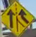
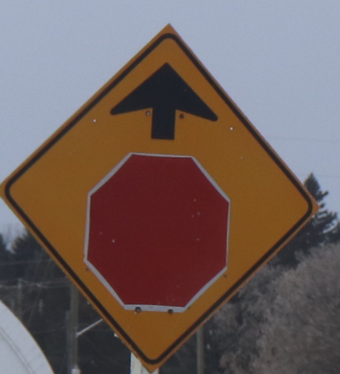
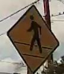
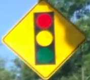
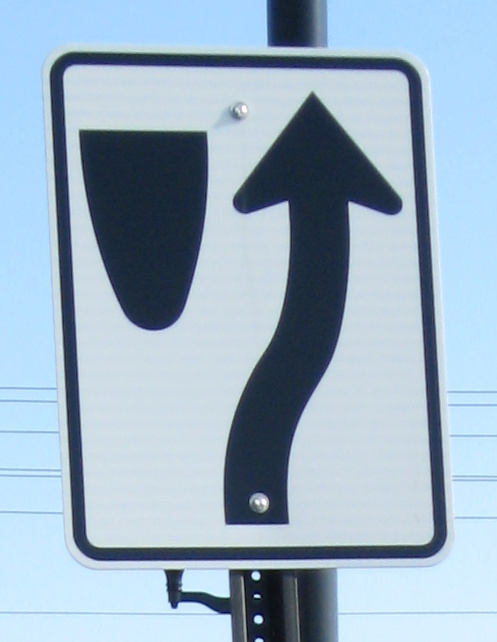
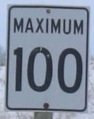
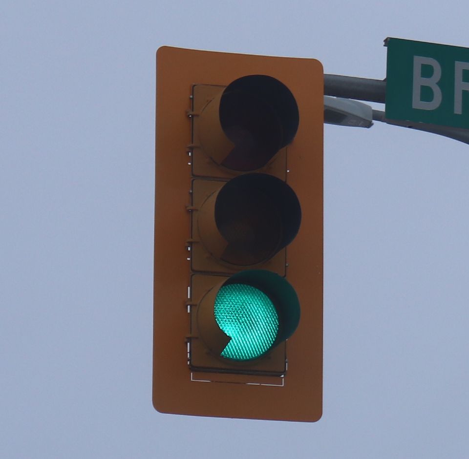
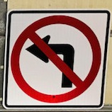
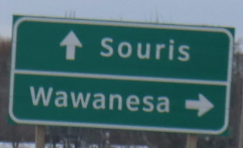
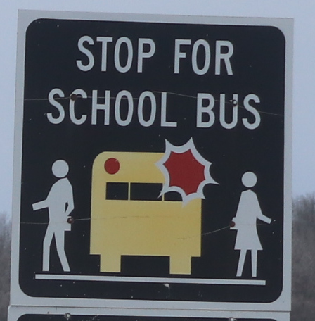

# Traffic signs recognition in TensorFlow2

This is an exercise in image recognition. The goal is to train a simple convolutional network to recognize some traffic signs.

### Data

#### Basis of the dataset

My final dataset is the result of compilation from a number of sources. The basis is a LISA (Laboratory for Intelligent & Safe Automobiles) dataset available [here](http://cvrr.ucsd.edu/LISA/lisa-traffic-sign-dataset.html). LISA dataset is a set of frames with annotations, out of which I extracted images of traffic signs with labels. I chose to keep only 12 categories of **US traffic signs**, as they were best represented. Here is the list:

1. Added Lane
2. Left Curve
3. Right Curve
4. Keep Right
5. Lane Ends
6. Merge
7. Pedestrian Crossing
8. School
9. Signal Ahead
10. Stop
11. Stop Ahead
12. Yield

Any traffic sign which does not fall in one of the above categories (or even if it does, but not a US sign) will not be recognized by the neural net.

As some of the images were in grayscale, I had to convert everything to grayscale. Next, I threw away images that were too small (some signs were as small as 6x6 pixels), and I also purged very low-quality images (yes, I had to actually look at all of them). At the end of this stage, I was left with around 5,000 images.

#### Dataset augmentation

After I formed the basis of the dataset as described above, the images were not even nearly uniformly distributed between the selected 12 categories. Some categories had noticeably smaller number of images than others. Initial training confirmed that the dataset will benefit from augmentation, with the focus of this augmentation on the under-represented categories. I augmented the dataset in three different ways:

##### 1) Youtube

This proved to be time consuming, but nevertheless the most effective way. There are lots of dash cam videos on youtube. You can stop the video when you see a traffic sign which you want for your dataset, make a print screen, and later (after you aggregated lots of print screens) crop and label the pictures. As the basis dataset had lots of stop signs in it, but not so many merge, lane ends, and yield signs, I focused more on highway than on city videos. I spent around 30 hours on youtube, and generated around 500-600 new images from that. It is not a lot percentage-wise, but as those images were mostly in badly needed categories, this improved accuracy very substantially.

##### 2) Drive around and take pictures

I asked my wife to take pictures of traffic signs as we drive. We got 250 photos, out of which only under 100 were used for the selected 12 categories. We live in Canada and our left curve, right curve, pedestrian crossing signs differ from the US versions. We also deliberately took pictures of signs outside of 12 categories to use as negative examples (more on this [later](#negative-examples)).

##### 3) European datasets

[Belgium traffic sign dataset](https://btsd.ethz.ch/shareddata/) is publicly available at the time of writing, [German dataset](https://benchmark.ini.rub.de?section=gtsrb&subsection=dataset) was available for downloading when this work was done (maybe you still can download it from somewhere else). As European stop signs look the same as the US, I took this category from the above datasets. That was easy but didn't make much difference as I already had a good number of stop signs in the dataset.

After augmentation, I ended up with **6,180** reasonable quality images in 12 categories.

#### Negative examples

Adding negative examples is easy, all you need to care about is that you don't accidentally place a "positive" image (image with a traffic sign from one of 12 categories) in your folder with negative examples. The bulk of my negative examples came from Belgium and German traffic sign datasets (after I carefully removed from them what might be close to positive examples), and from previously discarded LISA dataset categories. I added 53,820 negative examples to the dataset, thus making its total size **60,000** (6,180 positive + 53,820 = 60,000 total). After I added negative examples to the dataset I observed a substantial drop in false positive rate (that is when the neural net claims to recognize an image as a traffic sign from one of the above 12 categories, while in reality there is either no traffic sign at all or a sign not from these 12 categories).

When labeling negative examples in vector space I was faced with a choice. One option is to label them with 12 dimensional vector with zeros everywhere (the image does not belong to any of 12 categories). The second option is to label them with 13 dimensional vector with 1 in 13th position and zeros everywhere else (belongs to the newly created category #13), while all positive images will have 0 in 13th position and 1 in one place somewhere else. I had somewhat better results with the option 2 (13 dimensional space), so this is what's implemented in the code presented.

#### Final training dataset files

Training dataset consists of two numpy files: X.npy - images, and Y.npy - labels. Array in X.npy has a shape (60000,32,32,1) - 60,000 images scaled to 32x32 pixels, 1 channel (grayscale). Array in Y.npy has a shape (60000,13) - labels for 60,000 images, each label is a 13 dim vector with single 1 and twelve zeros. Thus \[0, 0, 0, 1, 0, 0, 0, 0, 0, 0, 0, 0, 0\] labels category #4 - Keep Right, \[0, 0, 0, 0, 0, 0, 0, 0, 0, 0, 0, 0, 1\] labels negative example (no traffic sign from 12 categories).

Files X.npy and Y.npy get loaded into dataset/ folder first time when you run training. Alternatively you can download them manually from my google drive:
```
Xnpy_url='https://drive.google.com/uc?id=164UxnaPrtAJ7XNZvFmq-1NoruBWm1v2C'
Ynpy_url='https://drive.google.com/uc?id=1m0bHHw9RWUaJbuNtTAxL12kP90YkUlsA'
```


#### Test set and scoring system

As I only had to deal with 12 categories, I could afford a luxury of building a test set completely separately from the training set. Splitting one dataset into train and test sets (which is a regular practice) might sometimes give us a false sense that everything is OK, while it is not. Neural net might learn "shortcuts" instead of real features, then successfully apply the results of this "shortcut" learning to test examples, which were obtained by the same methods (the same operator, on the same day with the same light conditions, with the same camera, and the same filming techniques, etc ...). If, however, test set images are acquired by completely different means, then we expect the results of testing be more rigorous.

Here is what I did. First, I downloaded from the Internet (or used my own) a total of **175 images** of traffic signs belonging to my 12 categories. These are some examples:

                
##### Examples of test images of traffic signs belonging to my 12 categories

&nbsp;

&nbsp;

Then I downloaded from the Internet (or used my own) a total of **130 images** of traffic regulation objects not belonging to my 12 categories :

                
##### Examples of test images of traffic signs not belonging to my 12 categories

&nbsp;

&nbsp;

And finally, I downloaded **50** completely irrelevant images:

                
##### Examples of test images showing something fully irrelevant

&nbsp;

&nbsp;

Numpy arrays pertaining to all the test images are in val_npy/ folder. If you want to see the original photos, you can get them from my google drive:
```
https://drive.google.com/file/d/1vH-rfMu7qzkicp_McVffsYXMLUxN9nPF/view?usp=sharing
```


### Convolutional Network used

### How to run training/testing, and my results


 


